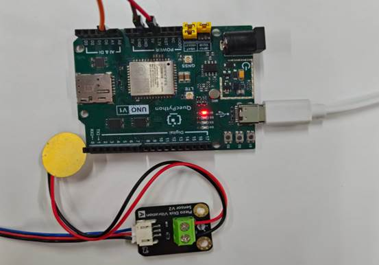

# Analog Piezoelectric Ceramic Vibration Module

## 1. Module Introduction

This sensor is an analog vibration sensor based on piezoelectric ceramic sheets. It utilizes the inverse transformation process where piezoelectric ceramics generate vibration from electrical signals. When the piezoelectric ceramic sheet vibrates, the signal terminal of the sensor generates an electrical signal. The module is compatible with various single-chip microcontroller control boards, such as Arduino series single-chip microcontrollers. The module includes 2 types of interfaces for your choice: one is a reverse-connection prevention white terminal with a pitch of 2.54mm. In use, we can stack a sensor expansion board on the single-chip microcontroller, connect the module with the built-in wire, and then connect it to the sensor expansion board, which is simple and convenient; the other is a pin header interface with a pitch of 2.54mm, which can be directly connected to the single-chip microcontroller using male-to-female Dupont wires.

**Working Principle**:

- **As vibration output (inverse piezoelectric effect)**: The module has power supply, ground, and signal terminals. When a pulse/square wave electrical signal is input to the signal terminal, the piezoelectric ceramic sheet deforms due to the inverse piezoelectric effect, driving the substrate to vibrate to achieve vibration feedback.
- **As vibration detection (direct piezoelectric effect)**: When the module is subjected to mechanical vibration/knocking, the piezoelectric ceramic sheet generates a weak electrical signal, which is output through the signal terminal. The development board can detect the vibration intensity through ADC acquisition.

## 2. Connection Example

Connect the peripheral to the development board one-to-one according to the table and picture instructions:

| Peripheral  | Development Board |
| ----------- | ----------------- |
| Module（+） | 3.3V              |
| Module（-） | GND               |
| Module（S） | A1（ADC1）        |

 


## 3.Driver Code

```python
def fun():

  while True:

     num=adc.read(adc.ADC1)

     utime.sleep(1)

     print(num)


if name=='main_':

  adc = ADC()

  adc.open()

  _thread.start_new_thread(fun,())
```

 